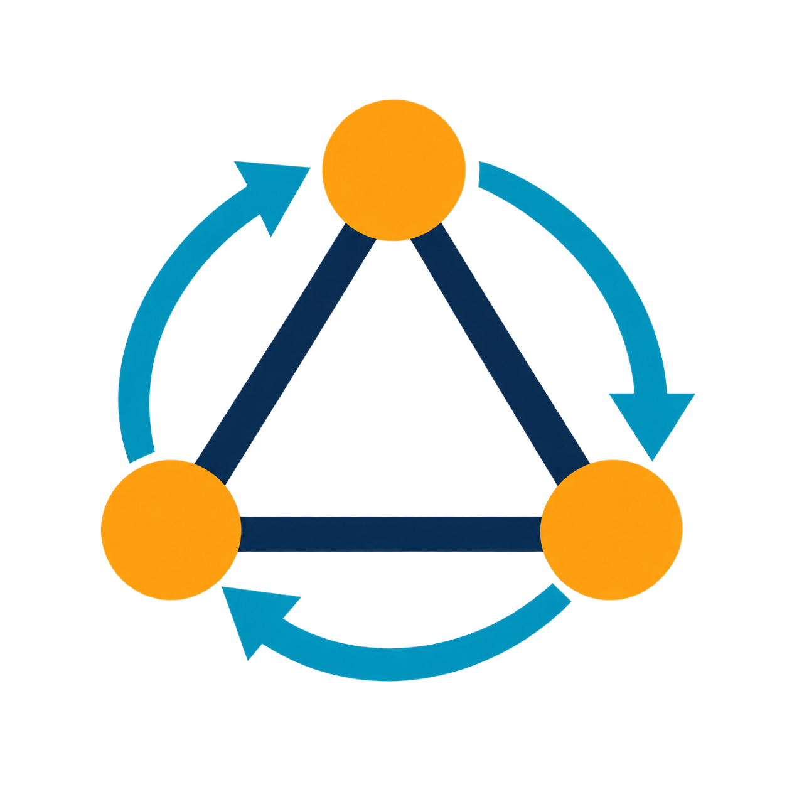
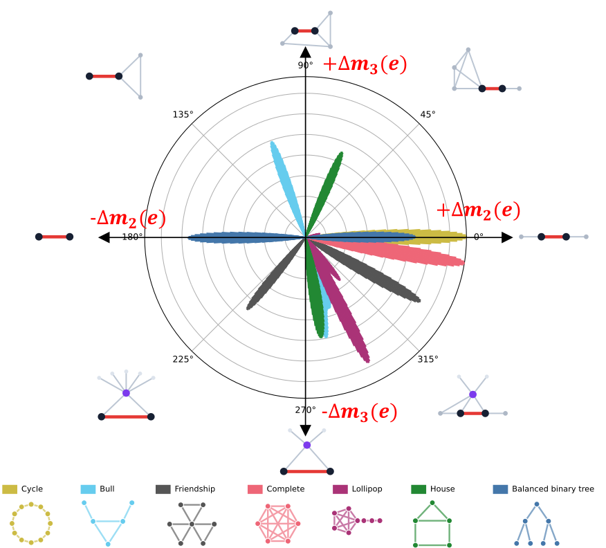
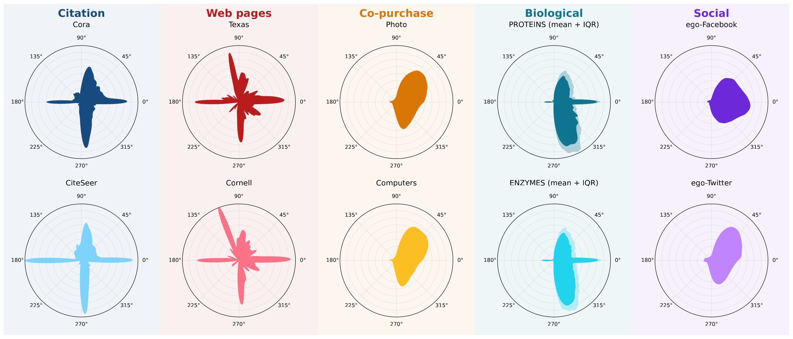
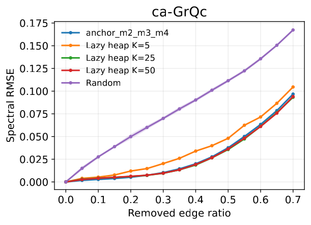
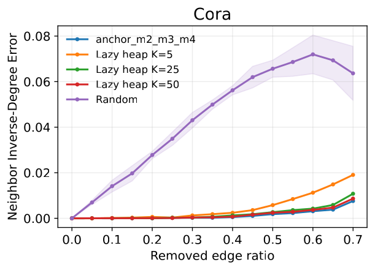
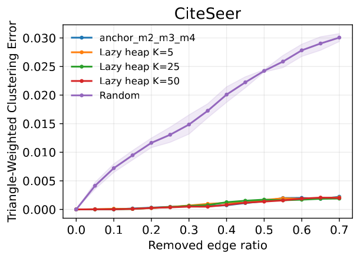
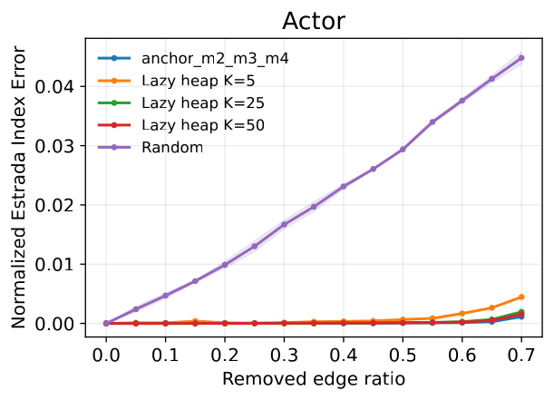
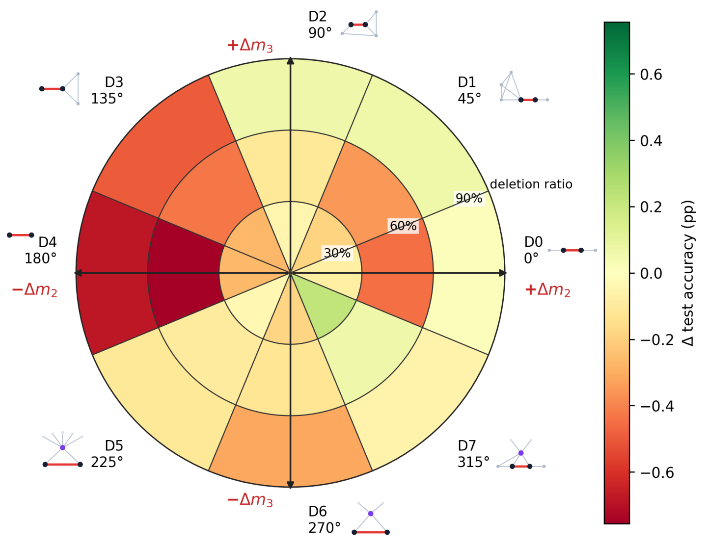
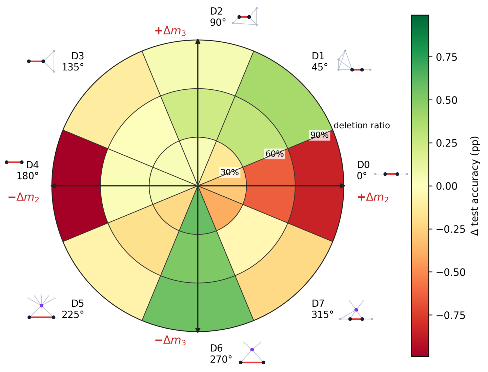

<!-- # Moment-Guided Graph Sampling (MGGS) -->
<h1>
  
  Moment-Guided Graph Sampling (MGGS)
</h1>


<!-- > Official implementation of the arXiv preprint [*Moments-Guided Edge Sampling*](<arxiv-url>).
 -->

*How can we quantify and control the effect of a **local edge edit**—an addition or deletion—on **global graph structure**?* We characterize each edit by its **moment change**, which measures how it alters length-$k$ closed walks, and use this signal to guide graph sampling.


<p align="center">
  <a href="assets/key_insights/only_classic_with_graphs2.pdf"></a>
</p>

<p align="center"><em>Each edge can be represented by its perturbation effect—for example, the moment change Δm<sub>k</sub>(e) caused by its deletion. Together, these local effects reveal the graph's global structure.</em></p>

## Contents

- [Method overview](#method-overview)
- [Key insights](#key-insights)
- [Download](#1-download)
- [Quick run](#2-quick-run)
- [Reproduce the experiments](#3-reproduce-the-experiments)
- [Interface parameters](#4-interface-parameters)


## Method overview

Spectral moments summarize global structure through closed random walks. For a graph $G$ with $n$ nodes and random-walk transition matrix $P$, the $k$-th moment is $m_k(G)=\frac{1}{n}\operatorname{Tr}(P^k)$. Let $\mathcal{K}=\{k_1,\ldots,k_p\}$ be the selected orders, $\mathbf{m}=(m_k)_{k\in\mathcal{K}}$ the current moment profile, and $\mathbf{m}^{*}=(m_k^{*})_{k\in\mathcal{K}}$ the target profile.

MGGS edits edges to move $\mathbf{m}$ toward $\mathbf{m}^{*}$. An edit is written as $\epsilon=(o,u,v)$, where $o\in\{\mathrm{ADD},\mathrm{DELETE}\}$ specifies whether edge $(u,v)$ is added or removed. Let $G^{\epsilon}$ be the edited graph and $P^{\epsilon}$ its random-walk transition matrix. The resulting change in the $k$-th moment is

$$
\Delta m_k(\epsilon)=m_k(G^{\epsilon})-m_k(G)
=\frac{1}{n}\left[\operatorname{Tr}\!\left((P^{\epsilon})^k\right)-\operatorname{Tr}\!\left(P^k\right)\right].
$$

These changes describe how one local edit moves the graph in moment space. MGGS computes them exactly using two complementary approaches: the **combinatorial/topology method** tracks affected local closed walks and gives $O(1)$ closed-form updates for low-order moments, while the **low-rank method** exploits locality and cyclic trace invariance to support arbitrary orders and batched edits. For a single-edge edit, the low-rank method reduces the cost from $O(kmn)$ with direct recomputation to $O(km)$, where $m$ is the number of edges.

For each candidate edit $\epsilon$, the predicted profile is $\mathbf{m}+\Delta\mathbf{m}(\epsilon)$. MGGS scores its normalized distance to the target:

$$
\operatorname{score}(\epsilon)
=\sum_{k\in\mathcal{K}}
\left(\frac{m_k+\Delta m_k(\epsilon)-m_k^{*}}{\sigma_k}\right)^2,
\qquad \sigma_k=m_k(G).
$$

At step $t$, it selects the best candidate from the current set $\mathcal{C}_t$,

$$
\epsilon_t^{*}=\underset{\epsilon\in\mathcal{C}_t}{\arg\min}\;
\operatorname{score}(\epsilon),
$$

applies the edit, updates $\mathbf{m}\leftarrow\mathbf{m}+\Delta\mathbf{m}(\epsilon_t^{*})$, and repeats until the edit budget is reached. Candidates may contain edge additions, deletions, or both.

**Lazy top-k rescoring.** Applying one edit can change another candidate's $\Delta m_k(\epsilon)$, but this interaction is controlled by locality and admits a bound: nearby edges are affected most, while many cached scores remain unchanged or change only slightly. MGGS therefore caches all scores once and, after each edit, exactly recomputes only the $K_{\mathrm{top}}$ candidates with the lowest cached scores. It selects the best refreshed candidate and leaves the remaining scores cached for later steps. This approximate strategy reduces per-step rescoring from all $m$ candidates to only $K_{\mathrm{top}}\ll m$.

## Key insights

### 🔴 EXP1 — Moment-change fingerprints

Graphs from different domains exhibit distinct moment-change fingerprints, reflecting differences in their edge-formation mechanisms.

<p align="center">
  <a href="assets/key_insights/real_graphs_edge_direction_rose.pdf"></a>
</p>

### 🔵 EXP2 — Graph-property preservation

Preserving graph moments consistently retains diverse structural properties, while lazy top-k maintains comparable sampling quality.

<p align="center">
  <a href="assets/key_insights/spectrum_rmse_vs_remove_ratio.pdf"></a>
  <a href="assets/key_insights/mean_neighbor_inverse_degree_abs_error_vs_remove_ratio.pdf"></a>
  <a href="assets/key_insights/mean_triangle_weighted_clustering_abs_error_vs_remove_ratio.pdf"></a>
  <a href="assets/key_insights/normalized_estrada_index_abs_error_vs_remove_ratio.pdf"></a>
</p>

### 🟠 EXP3 — Potential for downstream graph learning

Perturbing different types of edges has different effects on supervised node classification.

<p align="center">
  <a href="assets/key_insights/cora_direction_ratio_sector_map.pdf"></a>
  <a href="assets/key_insights/citeseer_direction_ratio_sector_map.pdf"></a>
</p>


## 1. Download

```bash
git clone '<repository-url>' mggs
cd mggs
conda env create -f environment.yml
conda activate mggs
pip install -e '.[fast,experiments]'
```

Cora is downloaded on first use and cached in `data/`.

## 2. Quick run

### Compute whole-graph moments

```python
from mggs.datasets import load_graph_dataset
from mggs.io.graph import undirected_simple_edges
from mggs import compute_moments

data = load_graph_dataset("Cora")
edges = undirected_simple_edges(data.edge_index)
moments = compute_moments(edges, data.num_nodes, orders=(2, 3, 4))
print("moments:", {k: round(v, 6) for k, v in moments.items()})
# Output: moments: {2: 0.277065, 3: 0.02225, 4: 0.161626}
```

### Query moment changes from edge edits

`MomentDeltaCalculator` caches one graph for repeated queries. It computes effects without applying edits or selecting edges.

**Combinatorial/Topology — specialized formulas for orders 2 and 3:**

```python
from mggs import MomentDeltaCalculator
from mggs.datasets import load_graph_dataset
from mggs.io.graph import undirected_simple_edges

data = load_graph_dataset("Cora")
edges = undirected_simple_edges(data.edge_index)
calculator = MomentDeltaCalculator.from_undirected_edges(edges, data.num_nodes)
deleted = calculator.deletion_deltas([(0, 633)], orders=(2, 3), backend="topology")
added = calculator.addition_deltas([(0, 1)], orders=(2, 3), backend="topology")
print("deletion delta:", {k: round(float(deleted[k][0]), 10) for k in deleted.orders})
print("addition delta:", {k: round(float(added[k][0]), 10) for k in added.orders})
# Output:
# deletion delta: {2: 5.29518e-05, 3: 3.32681e-05}
# addition delta: {2: -0.0001148859, 3: -1.53865e-05}
```

**Low-rank — for arbitrary orders, and batch edits:**

```python
from mggs import MomentDeltaCalculator
from mggs.datasets import load_graph_dataset
from mggs.io.graph import undirected_simple_edges

data = load_graph_dataset("Cora")
edges = undirected_simple_edges(data.edge_index)
calculator = MomentDeltaCalculator.from_undirected_edges(edges, data.num_nodes)
deleted = calculator.deletion_deltas([(0, 633)], orders=(2, 3, 4), backend="low_rank")
added = calculator.addition_deltas([(0, 1)], orders=(2, 3, 4), backend="low_rank")
joint = calculator.batch_edit_delta(
    deletions=[(0, 633)], additions=[(0, 1)], orders=(2, 4),
)
print("deletion delta:", {k: round(float(deleted[k][0]), 10) for k in deleted.orders})
print("addition delta:", {k: round(float(added[k][0]), 10) for k in added.orders})
print("joint edit delta:", {k: round(v, 10) for k, v in joint.items()})
# Output:
# deletion delta: {2: 5.29518e-05, 3: 3.32681e-05, 4: 3.52507e-05}
# addition delta: {2: -0.0001148859, 3: -1.53865e-05, 4: -0.0001115261}
# joint edit delta: {2: -6.19342e-05, 4: -7.62307e-05}
```

Each moment change/delta is `m(after) − m(before)`. Candidate deltas are independent; a joint edit must be evaluated together, rather than summing independent effects.

### Sample by target moments

```python
from mggs.datasets import load_graph_dataset
from mggs.io.graph import undirected_simple_edges
from mggs import sample_by_moments

data = load_graph_dataset("Cora")
edges = undirected_simple_edges(data.edge_index)
topology_result = sample_by_moments(
    edges, data.num_nodes, budget=100, target=None, orders=(2, 3),
    operation="delete", strategy="greedy", backend="topology", seed=0,
)
low_rank_result = sample_by_moments(
    edges, data.num_nodes, budget=100, target=None, orders=(2, 3),
    operation="delete", strategy="greedy", backend="low_rank", seed=0,
)
for backend, result in [("topology", topology_result), ("low_rank", low_rank_result)]:
    print(f"{backend}: {len(edges)} -> {len(result.edges)} edges")
    print("  final moments:", {k: round(v, 6) for k, v in result.final_moments.items()})
    print("  total change:", {k: round(v, 10) for k, v in result.delta_moments.items()})
# Output:
# topology: 5278 -> 5178 edges
#   final moments: {2: 0.277066, 3: 0.02225}
#   total change: {2: 4.744e-07, 3: 1.116e-07}
# low_rank: 5278 -> 5178 edges
#   final moments: {2: 0.277066, 3: 0.02225}
#   total change: {2: 4.744e-07, 3: 1.116e-07}
```

`target=None` uses original moments. Supply absolute values, such as `target={2: 0.25, 3: 0.03}`, to change the objective. The same optimizer performs exactly `budget` edits; reaching the target is not guaranteed.

### Visualization: moment-change fingerprint

```python
from mggs.datasets import load_graph_dataset
from mggs.io.graph import undirected_simple_edges
from mggs import save_moment_change_fingerprint

data = load_graph_dataset("Cora")
edges = undirected_simple_edges(data.edge_index)
path = save_moment_change_fingerprint(
    edges, data.num_nodes, "results/examples/cora_moment_change_fingerprint.png", title="Cora",
)
print("saved path:", path.as_posix())
print("file exists:", path.is_file())
# Output:
# saved path: results/examples/cora_moment_change_fingerprint.png
# file exists: True
```

This exports one EXP1-style moment-change fingerprint: angle represents the scaled `(Δm2, Δm3)` direction of an independent edge deletion, and sector area represents its smoothed probability. All edges have equal weight. Zero deltas have no direction and are excluded.

<a id="reproduction"></a>

## 3. Reproduce the experiments

Run from the repository root.

```bash
conda activate mggs
export CONDA_ENV=mggs
```

**EXP1 — moment-change fingerprints (Figure 2)**

```bash
bash scripts/EXP1_reproduce_edge_density.sh
```

**EXP2 — sampling efficiency and graph-property preservation (Figure 5)**

```bash
bash scripts/EXP2_run_sampling_comparison.sh all
```

**EXP3 — graph learning on Cora and CiteSeer**

**Effect of removing edges from different moment-change direction on supervised node classification (Figure 4)**. Use two GPUs:

```bash
DATASETS="Cora CiteSeer" GPU_IDS="0 1" SHARDS_PER_DATASET=1 \
  bash scripts/EXP3_run_supervised_edge_direction.sh
```

**graph contrastive learning: preserve the original moments only.** Use `MODE=main` to train only `target_036`, whose target is the original graph's `(m2, m3)`. Sampling still edits 20% of the original edge count while minimizing moment deviation; exact preservation is not guaranteed. The run uses 16 sampled graphs per dataset and training seeds 15–24.

```bash
export RUN_ROOT="$PWD/results/EXP3_graph_learning/unsupervised_node_classification/reproduce_$(date -u +%Y%m%d_%H%M%S)"
MODE=main DATASETS="Cora CiteSeer" GPU_IDS="0 1" \
  bash scripts/EXP3_run_unsupervised_moments.sh
```

The new output directory starts fresh training without overwriting existing results. Compatible sampled graphs are reused from `data/<Dataset>/moments_gcl/mixed20_grid37_bank16/`. Results are saved under `$RUN_ROOT/<Dataset>/bank/ratio_0.2/shards/target_036/`; original-target summaries are under `bank/ratio_0.2/subsets/target_036/`. Reusing a run directory skips targets marked `.done`. For Cora alone, set `DATASETS="Cora" GPU_IDS="0"`.

**Optional full landscape (Figure 7):** after main finishes, run the following in the same shell with the same `RUN_ROOT`. This evaluates all 37 moment targets and reuses completed original-target results. Skip this command if you only need moment preservation.

```bash
MODE=landscape DATASETS="Cora CiteSeer" GPU_IDS="0 1" \
  bash scripts/EXP3_run_unsupervised_moments.sh
```

Unsupervised runs use seeds 15–24 with a 10%/10%/80% train/validation/test split.

## 4. Interface parameters

All interfaces accept simple, unweighted, undirected graphs. `edges` is an `(E, 2)` integer array/list with each edge listed once; `num_nodes` includes isolated nodes. Inputs are validated and never mutated.

### `compute_moments(edges, num_nodes, *, orders=(2, 3))`

`orders` accepts any nonempty collection of positive integers. Low orders use specialized formulas; higher orders use exact matrix-power traces and may be expensive.

**Returns — `dict[int, float]`:** `{order: moment}` with sorted, unique keys.

### `MomentDeltaCalculator.from_undirected_edges(edges, num_nodes)`

| Method / parameter                                                            | Meaning                                                                             |
| ----------------------------------------------------------------------------- | ----------------------------------------------------------------------------------- |
| `deletion_deltas(candidate_edges=None, *, orders=(2, 3), backend="low_rank")` | Evaluate each deletion independently; `None` evaluates every existing edge          |
| `addition_deltas(candidate_edges, *, orders=(2, 3), backend="low_rank")`      | Evaluate each addition independently; candidates must be absent edges               |
| `batch_edit_delta(*, additions=None, deletions=None, orders=(2, 3))`          | Evaluate additions and deletions jointly as one graph edit                          |
| `orders`                                                                      | Integer orders ≥ 2; nonconsecutive orders are allowed, deduplicated and sorted      |
| `backend`                                                                     | `low_rank` supports any requested order ≥ 2; `topology` accepts only orders 2 and 3 |

**Returns**

| Call                                 | Type and contents                                                                                                                                                       |
| ------------------------------------ | ----------------------------------------------------------------------------------------------------------------------------------------------------------------------- |
| `deletion_deltas`, `addition_deltas` | `CandidateDeltaMoments`: `.edges[i]` is candidate `i`, `.orders` lists the returned orders, and `result[k][i]` (equivalently `.values[k][i]`) is its delta at order `k` |
| `batch_edit_delta`                   | `dict[int, float]`: `{order: joint_delta}` for the requested orders                                                                                                     |

Every delta is `moment_after − moment_before`. Use `MomentDeltaCalculator` to build custom sampling strategies.

### `sample_by_moments(edges, num_nodes, *, budget, ...)`

Each step minimizes `sum(((moment_after[k] - target[k]) / scale[k]) ** 2)`.

| Parameter         | Default and meaning                                                                                                                                                        |
| ----------------- | -------------------------------------------------------------------------------------------------------------------------------------------------------------------------- |
| `budget`          | Required exact edit count; previous edits cannot be undone                                                                                                                 |
| `target`          | `None`: preserve the original moments; otherwise `{order: absolute target}`                                                                                                |
| `orders`          | Inferred from `target`; defaults to `(2, 3)` when `target=None`; integers ≥ 2                                                                                              |
| `operation`       | `"delete"` (default), `"add"`, or `"mixed"`                                                                                                                                |
| `strategy`        | `"greedy"` (default): fully rescore the current candidate set each step; `"lazy"`: refresh the cached top-k candidates using a heap; lazy currently supports deletion only |
| `candidate_limit` | `None`: use all candidates; a positive integer caps candidates per operation per greedy step                                                                               |
| `top_k`           | `25`; number of cached candidates refreshed by lazy; requires `candidate_limit=None`                                                                                       |
| `scale`           | `None`: use fixed absolute original moments (values ≤ `1e-12` become 1); or `{order: positive scale}` covering all requested orders                                        |
| `backend`         | `"low_rank"` (default); `"topology"` is available for orders 2 and 3                                                                                                       |
| `seed`            | `0`; controls candidate subsampling                                                                                                                                        |
| `checkpoints`     | `()`; edit counts whose intermediate graph and moments are retained                                                                                                        |

**Returns — `SamplingResult`**

| Field             | Type and meaning                                                                                       |
| ----------------- | ------------------------------------------------------------------------------------------------------ |
| `edges`           | `np.ndarray`; final undirected edges with shape `(E_final, 2)`                                         |
| `edits`           | `tuple[EdgeEdit, ...]`; applied edits in execution order                                               |
| `initial_moments` | `dict[int, float]`; exact moments before editing                                                       |
| `final_moments`   | `dict[int, float]`; exact moments after all edits                                                      |
| `delta_moments`   | `dict[int, float]`; `final_moments − initial_moments`                                                  |
| `snapshots`       | `dict[int, GraphSnapshot]`; graph edges and exact moments at requested checkpoints                     |
| `metadata`        | `dict`; resolved target, scale, orders, operation, strategy, backend, budget, seed and search settings |

Final and checkpoint moments are recomputed exactly. Infeasible budgets raise an error.

### `save_moment_change_fingerprint(edges, num_nodes, output_path, *, settings=None, title=None, color="#174A7E", dpi=220)`

The suffix of `output_path` selects PNG, PDF or SVG. `title`, `color` and `dpi` control appearance. `EdgeDirectionSettings(scale_mode="graph_relative", grid_step_deg=0.5, bandwidth_deg=3.0, chunk_size=2048)` controls scaling and circular smoothing; duplicate/reversed edges collapse, self-loops are ignored, and isolated nodes must be included in `num_nodes`.

**Returns — `pathlib.Path`:** the saved file path. Parent directories are created, an existing file is overwritten, and the figure is closed.

## Citation

If you find this helpful, please cite the paper:

```bibtex

```
